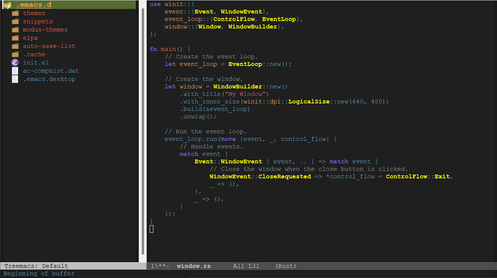

## About this theme

In order to install this theme, you should download the `brudy-theme.el` file, and put it in your `custom-theme-load-path`.
You can specify your path in your `~/.emacs.d/init.el` file.
For instance, suppose you have saved `brudy-theme.el` file in the `~/.emacs.d/themes` directory:

```
;;in your init.el file

(add-to-list 'custom-theme-load-path "~/.emacs.d/themes")
(load-theme 'brudy t)
```

Note that the `~/.emacs.d/themes` directory can be created if not exists.


## Screenshots



